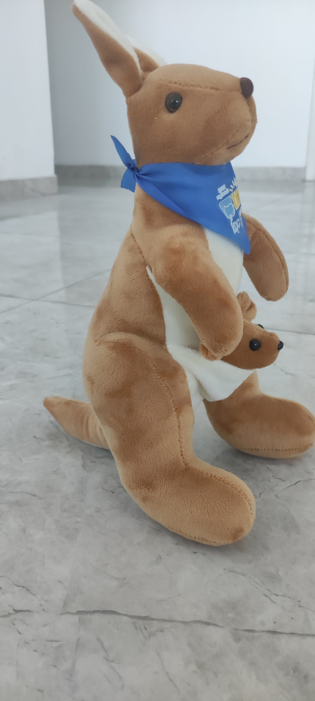
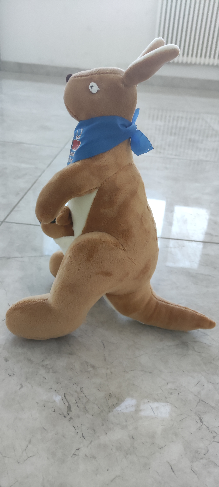

# JNerf

Term project I for Computer Graphics

Environment: Linux

Library: colmap、instant-ngp、JNeRF

### 环境配置&数据准备

这里介绍的是从零开始配置的方法。我提供的文件夹中已经完成了数据准备，只需要运行JNeRF进行3D重建。

#### colmap

从源码编译colmap库，编译方法参考[colmap/colmap: COLMAP - Structure-from-Motion and Multi-View Stereo (github.com)](https://github.com/colmap/colmap)。

编译完成后，运行下面的命令以获得图片的稀疏表示。

```sh
colmap feature_extractor --database_path ./database.db --image_path ./images

colmap exhaustive_matcher --database_path ./database.db

mkdir ./sparse

colmap mapper \
    --database_path ./database.db \
    --image_path ./images \
    --output_path ./sparse

mkdir ./colmap_text

colmap model_converter \
    --input_path ./sparse/0 \
    --output_path ./colmap_text \
    --output_type TXT
```

#### intant-ngp

从[NVlabs/instant-ngp: Instant neural graphics primitives: lightning fast NeRF and more (github.com)](https://github.com/NVlabs/instant-ngp/tree/master)获得instant-ngp的源代码。

找到colmap2nerf.py，运行如下脚本

```sh
python colmap2nerf.py
```

将图片的稀疏表示转换成ngp所需的json格式。

#### JNeRF

从[Jittor/JNeRF: JNeRF is a NeRF benchmark based on Jittor. JNeRF re-implemented instant-ngp and achieved same performance with original paper. (github.com)](https://github.com/Jittor/JNeRF)获得JNeRF。按照其中的方法配置环境。

> ```sh
> python3.x -m pip install --user -e .
> ```
>
> 注意，如果用root用户运行，需要创建虚拟环境，并且删去这里的--user，以消除warning。

在data/kangaroo文件夹下放入项目的images文件夹，以及生成的transforms.json。注意需要使得data/kangaroo下的各项文件与data/fox格式相同，以方便程序读取。

在JNeRF/projects/ngp/configs下新增ngp_kangaroo.py，将其中的dataset_dir改为'data/kangaroo'，exp_name改为"kangaroo"，fp16改为False（如果在官方数据集上不报错，也可以不更改fp16）。

### 运行程序

运行以下命令：

```sh
python tools/run_net.py --config-file ./projects/ngp/configs/ngp_kangaroo.py
```

以获得重建的模型。

运行以下命令：

```sh
python tools/run_net.py --config-file ./projects/ngp/configs/ngp_kangaroo.py --task render
```

以获得视频示例。

> 由于拍摄时图片是乱序的，视频并不稳定。但是，生成的模型是没有问题的。

### 实验结果

下面是拍摄的原始图片的示例。





在重建后，程序获得了图片输出。

这是4096步的图片输出：


这是20480步的图片输出：


这是36864步的图片输出：


可见，虽然图片生成质量还有提升空间（个人推测是因为手机拍摄的输入图片分辨率太高，在默认的步数中模型还没有充分收敛），但模型确实逐步学习到了隐式的场景表示。

